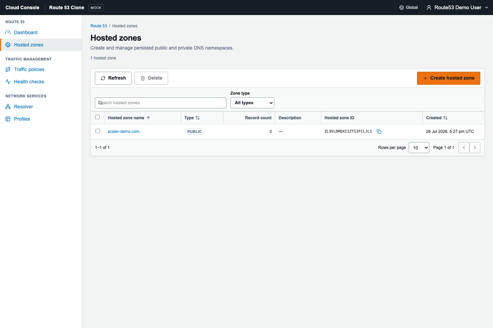
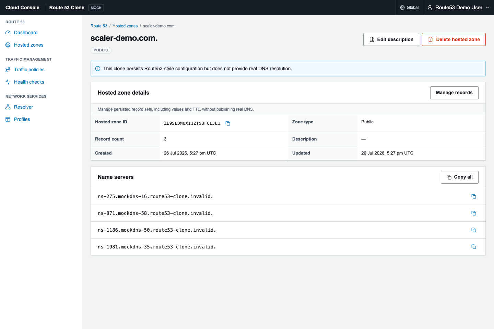
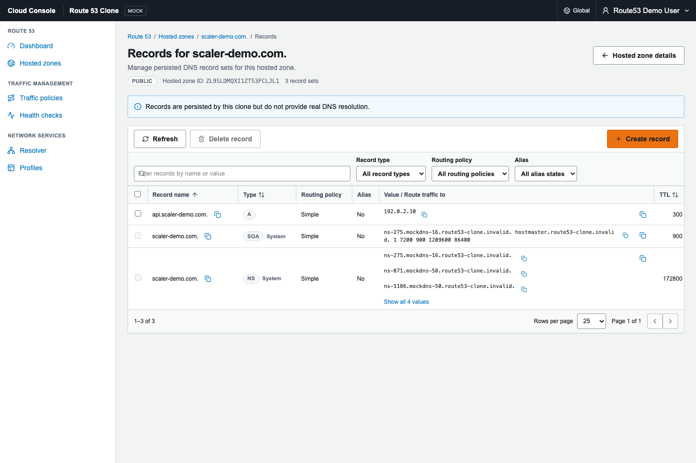
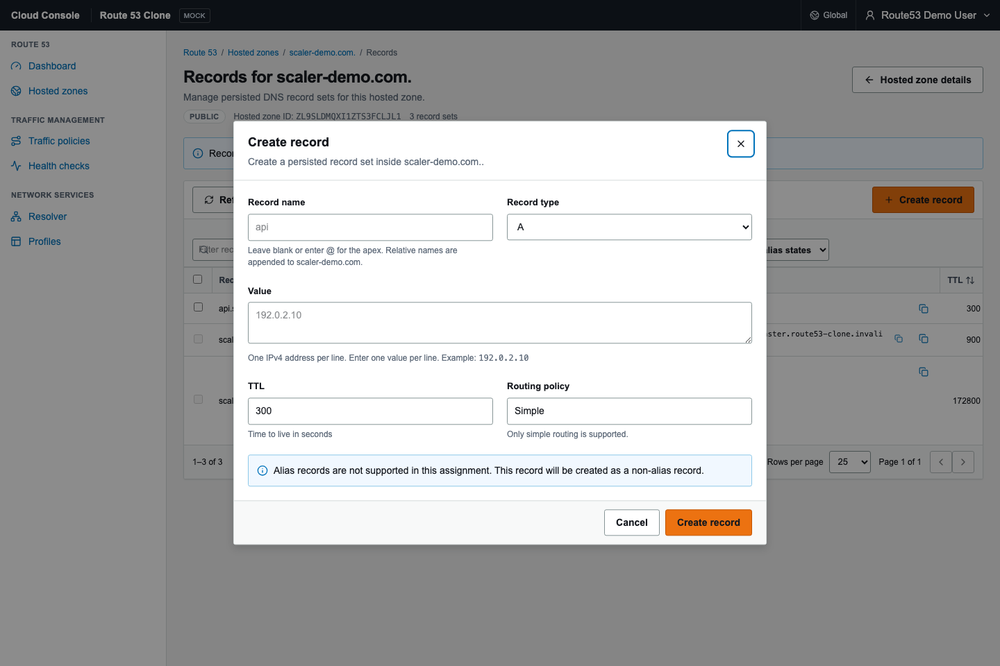
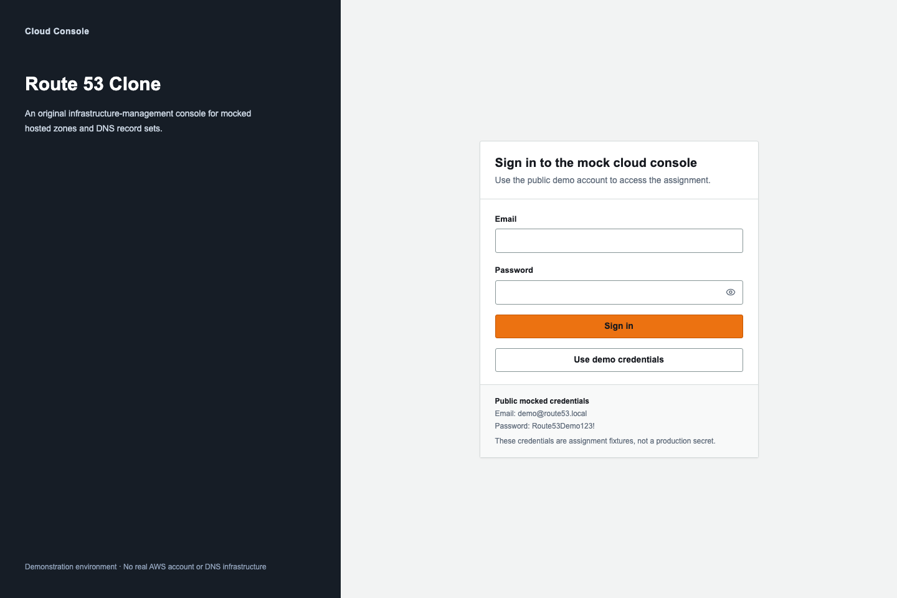
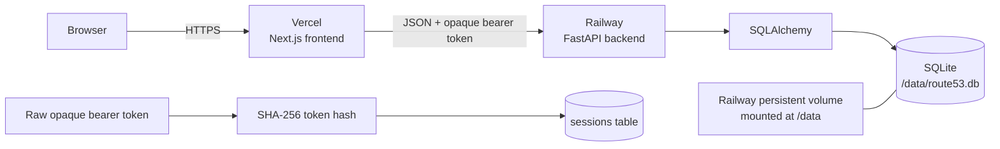

# Route53 Clone

Route53 Clone is an original, production-deployed application that recreates the
operational experience of managing AWS Route 53-style Hosted Zones and DNS
record sets. It combines a Next.js console, FastAPI API, and persistent SQLite
storage. The project is inspired by infrastructure-management UX, is not
affiliated with AWS, and does not publish or resolve real DNS.

## Live demo

- Frontend: <https://route53-clone-three.vercel.app>
- Backend API: <https://route53-clone-production-eb00.up.railway.app>
- API health: <https://route53-clone-production-eb00.up.railway.app/api/v1/health>
- Interactive API docs: <https://route53-clone-production-eb00.up.railway.app/docs>
- Source: <https://github.com/rit2001/route53-clone>

**No registration is required or supported. This assignment uses one seeded
public demo account.**

```text
Email: demo@route53.local
Password: Route53Demo123!
```

These are intentionally public mocked credentials for the deployed
demonstration, not a production secret.

## Screenshots

### Hosted Zone management



### Hosted Zone details



### DNS record sets



### Record editor



### Mock sign-in



## Key features

### Authentication

- Mock login and logout through one seeded public demo account
- Argon2 password hashing with no plaintext password storage
- Persistent opaque bearer sessions whose raw tokens are never stored in SQLite
- Browser session restoration, expiry checks, revocation, and protected routes

### Hosted Zones

- Persistent public and private Hosted Zones with ownership isolation
- Backend-driven search, public/private filtering, sorting, and pagination
- Creation, details, comment editing, typed deletion confirmation, and copy actions
- Deterministic mocked NS and SOA record generation for public zones

### DNS records

- CRUD for `A`, `AAAA`, `CNAME`, `TXT`, `MX`, `NS`, `PTR`, `SRV`, and `CAA`
- Visible, read-only generated `SOA` and system `NS` records
- Type-specific record-name and value validation with stable value deduplication
- CNAME conflict enforcement and system-record update/delete protection
- URL-backed search, filters, sorting, pagination, and page-scoped selection

### Console experience

- Original Route53-inspired responsive shell with dense operational tables
- Accessible navigation, forms, dialogs, loading states, alerts, and notifications
- Honest empty/error states, copy controls, responsive drawers, and visible focus

### Deployment

- Next.js frontend on Vercel and one-worker FastAPI backend on Railway
- SQLite database on a Railway persistent volume mounted at `/data`
- Fail-fast automatic Alembic migration and idempotent demo-user seeding
- Hosted Zone, DNS Record, session, and demo-user persistence verified after restart

## Architecture



The backend is a modular monolith with the enforced flow:

```text
API router -> service -> repository -> SQLAlchemy model/database
```

The frontend uses TanStack Query for server state, React Hook Form and Zod for
forms, URL search parameters for operational table state, and React Context only
for the mocked authentication session. See [Architecture](docs/architecture.md)
for request, transaction, authentication, and deployment details.

## Technology stack

| Area | Technology |
| --- | --- |
| Frontend | Next.js App Router, React, strict TypeScript, Tailwind CSS |
| Client data and forms | TanStack Query, React Hook Form, Zod |
| UI foundations | Radix Dialog, Lucide React, Sonner |
| Backend | Python, FastAPI, Pydantic Settings, Uvicorn |
| Persistence | SQLAlchemy 2.x, Alembic, SQLite |
| Authentication | pwdlib with Argon2, opaque bearer sessions |
| Testing | pytest, HTTPX, Vitest, React Testing Library |
| Deployment | Vercel, Railway, Docker |

## Production verification

**Status: complete, deployed, and production-verified.**

- The Vercel frontend communicates with the Railway API over HTTPS.
- Authentication, Hosted Zone CRUD, and DNS Record CRUD work in production.
- Public zones create persisted, protected NS and SOA record sets.
- Railway stores `route53.db` on its `/data` persistent volume.
- A Railway restart preserved users, sessions, Hosted Zones, and DNS records.
- The demo seed remained idempotent after restart.
- Nested frontend routes load and refresh correctly in production.
- CORS is restricted to the exact Vercel production origin.
- The public root, health endpoint, interactive docs, and repository links return
  successfully.

## Local development

### Prerequisites

- Node.js 20.9 or newer and npm
- Python 3.10 or newer; deployment uses Python 3.12
- Docker Desktop, optionally

Copy the documented local defaults:

```bash
cp .env.example .env
```

Start the backend:

```bash
cd backend
python3 -m venv .venv
source .venv/bin/activate
python -m pip install -r requirements-dev.txt
alembic upgrade head
python -m app.seed
uvicorn app.main:app --reload
```

The local API runs at `http://localhost:8000`, Swagger UI at
`http://localhost:8000/docs`, and health endpoint at
`http://localhost:8000/api/v1/health`.

Start the frontend in a second terminal:

```bash
cd frontend
npm install
npm run dev
```

The frontend defaults to `NEXT_PUBLIC_API_URL=http://localhost:8000/api/v1`.
Open `http://localhost:3000/login` and use the public demo account.

For a production-like local container flow:

```bash
docker compose up --build
```

Compose uses its own named volume at `/app/data`; it does not mount Railway's
production volume.

## API overview

All domain endpoints require `Authorization: Bearer <opaque-token>`.

```text
POST   /api/v1/auth/login
POST   /api/v1/auth/logout
GET    /api/v1/auth/me

GET    /api/v1/hosted-zones
POST   /api/v1/hosted-zones
GET    /api/v1/hosted-zones/{zone_id}
PATCH  /api/v1/hosted-zones/{zone_id}
DELETE /api/v1/hosted-zones/{zone_id}

GET    /api/v1/hosted-zones/{zone_id}/records
POST   /api/v1/hosted-zones/{zone_id}/records
GET    /api/v1/hosted-zones/{zone_id}/records/{record_id}
PATCH  /api/v1/hosted-zones/{zone_id}/records/{record_id}
DELETE /api/v1/hosted-zones/{zone_id}/records/{record_id}

GET    /api/v1/health
```

Example local login:

```bash
curl -X POST http://localhost:8000/api/v1/auth/login \
  -H "Content-Type: application/json" \
  -d '{
    "email": "demo@route53.local",
    "password": "Route53Demo123!"
  }'
```

Never commit the returned runtime token. Exact schemas, filters, validation
rules, response shapes, and error codes are documented in the
[API contract](docs/api-contract.md).

## Deployment

### Current production

- Vercel root directory: `frontend`
- Vercel API setting:
  `NEXT_PUBLIC_API_URL=https://route53-clone-production-eb00.up.railway.app/api/v1`
- Railway root directory: `backend`
- Railway config path: `/backend/railway.json`
- Railway health check: `/api/v1/health`
- Railway volume mount: `/data`
- Railway CORS origin: `https://route53-clone-three.vercel.app`
- Backend startup: migrate, idempotently seed, then `exec` exactly one Uvicorn
  worker

### Reproducing the Railway deployment

1. Import this GitHub repository and create one service rooted at `backend`.
2. Set the config file path to `/backend/railway.json`.
3. Attach a persistent volume mounted at exactly `/data`.
4. Configure the deployment variables below, substituting the final Vercel
   origin in the clearly marked template value:

   ```text
   APP_ENV=production
   DATABASE_URL=sqlite:////data/route53.db
   FRONTEND_ORIGIN=https://<your-vercel-production-origin>
   SESSION_TTL_HOURS=168
   DEMO_USER_NAME=Route53 Demo User
   DEMO_USER_EMAIL=demo@route53.local
   DEMO_USER_PASSWORD=Route53Demo123!
   LOG_LEVEL=INFO
   RAILWAY_RUN_UID=0
   ```

5. Deploy and confirm the logs show Alembic migration, a created-or-existing demo
   user, and one Uvicorn worker.
6. Verify `/api/v1/health` before connecting the frontend.

The checked-in entrypoint exits if migration or seeding fails and uses `exec` so
termination signals reach Uvicorn. The seed never silently resets an existing
password.

### Reproducing the Vercel deployment

1. Import the same repository and set the root directory to `frontend`.
2. Set the template variable
   `NEXT_PUBLIC_API_URL=https://<your-railway-domain>/api/v1`.
3. Deploy, copy the exact Vercel production origin, and set Railway
   `FRONTEND_ORIGIN` to that origin.
4. Redeploy Railway, then verify login, session restoration, both CRUD
   workflows, nested-route refresh, and restart persistence.

Preview origins are not wildcarded. The API never enables unrestricted CORS.
Use the completed [Production deployment checklist](docs/deployment-checklist.md)
for the verified acceptance record.

## Security and mocked authentication

There is deliberately no registration flow. The application uses one seeded
public demo account, and its password appears in this README and the login UI
because it is intentionally public assignment data.

The database stores an Argon2 password hash, never the plaintext password.
Successful login returns a cryptographically random opaque token once; SQLite
stores only its SHA-256 hash. Sessions have finite expiration and logout revokes
the current database session.

The browser stores only the raw token and expiry in local storage so the mocked
assignment session can survive refresh. It never stores the password or password
hash. A security-sensitive production identity system would reassess token
transport and browser storage, and would likely use hardened HTTP-only cookies,
CSRF protection, and a broader content-security policy.

## Limitations

- The application stores control-plane configuration but performs no real DNS
  publication, delegation, lookup, or resolution.
- AWS accounts, IAM, Organizations, Cognito, and VPC associations are mocked.
- Only `SIMPLE` routing is implemented.
- Alias targets are unsupported.
- Traffic Policies, Health Checks, Resolver, and Profiles are honest placeholders.
- Generated name servers use reserved `.invalid` domains.
- Self-service registration is intentionally unavailable.

## Testing

Final submission results:

- Backend: **272 tests passed**
- Frontend: **181 tests passed**
- ESLint: passed
- Strict TypeScript: passed
- Next.js production build: passed
- Alembic schema check: passed
- Production npm dependencies: zero known audit vulnerabilities
- Docker Compose production-like flow: passed
- Railway persistent-volume restart test: passed

Run the primary checks locally:

```bash
npm --prefix frontend run lint
npm --prefix frontend run typecheck
npm --prefix frontend run test
npm --prefix frontend run build

backend/.venv/bin/python -m pytest
backend/.venv/bin/python -m pip check
backend/.venv/bin/alembic check
```

Development-only tooling findings, if any, are distinct from the verified
zero-vulnerability production dependency audit.

## Repository structure

```text
route53-clone/
├── frontend/                  Next.js application, tests, and Dockerfile
├── backend/                   FastAPI application, tests, Alembic, and Dockerfile
│   └── railway.json           Railway service configuration
├── docs/
│   ├── screenshots/           Sanitized production application captures
│   ├── architecture.md
│   ├── api-contract.md
│   ├── data-model.md
│   ├── ui-specification.md
│   ├── implementation-plan.md
│   └── deployment-checklist.md
├── docker-compose.yml
└── README.md
```

## Licence

This project is available under the [MIT Licence](LICENSE).
