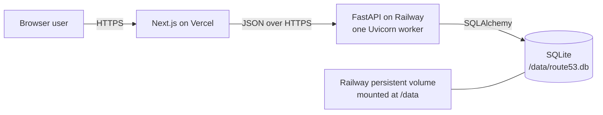
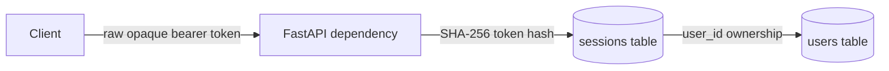

# Architecture

## System context

Route53 Clone is a learning-focused DNS management application. A browser client
uses an original Route53-inspired interface to manage mocked hosted zones and DNS
record sets. The system does not call AWS, publish DNS, or resolve real records.

The repository is a modular monolith with two deployable processes:

- A Next.js frontend renders the user experience and coordinates client state.
- A FastAPI backend owns application rules, persistence, and HTTP contracts.
- One SQLite database stores all application data.



## Responsibilities

### Frontend

The frontend owns rendering, accessibility, navigation, URL-derived list state,
form interaction, and displaying API outcomes. TanStack Query will own server
state. React Hook Form and Zod will own form state and client-side validation.
URL search parameters will own filtering, sorting, search, and pagination.
React Context is reserved for the mocked authentication session; modal visibility
and row selection remain local component state.

The frontend does not define authoritative business rules or directly access the
database.

### Backend

The backend validates requests, enforces authentication and ownership, applies
hosted-zone and record-set business rules, and produces stable JSON responses.
Each feature follows:

```text
API router -> Service -> Repository -> SQLAlchemy model/database
```

Routers translate HTTP input and output. Services coordinate business behaviour.
Repositories isolate queries and transactions. Models describe persistence.
Cross-feature infrastructure remains under `app/core`.

### Database

SQLite is the system of record. SQLAlchemy 2.x supplies the persistence boundary,
while Alembic owns schema changes. Foreign keys are enabled on every connection.
The local URL is configurable; production will use
`sqlite:////data/route53.db`.

## Modular-monolith decision

The assignment has one cohesive domain and a modest concurrency target. A modular
monolith makes boundaries testable without adding network calls or operational
components. It also keeps transactions involving zones, records, and sessions
atomic. Microservices, queues, Redis, and other distributed infrastructure would
increase failure modes without solving an assignment requirement.

## Request flow

1. Next.js sends a versioned JSON request to FastAPI.
2. The API router validates transport data with a Pydantic schema and resolves
   request dependencies.
3. A service enforces authentication, ownership, and domain rules.
4. A repository executes SQLAlchemy operations through the request-scoped session.
5. The service commits an intentional unit of work or rolls it back on failure.
6. The router serialises the response using a documented response schema.

No business policy belongs directly in route handlers or React components.

## Authentication

Authentication is deliberately mocked but persistent. It uses public demo
credentials and is not AWS IAM, Cognito, or another external identity system.



The login service normalises email, verifies the Argon2 password hash, generates
at least 256 bits of cryptographically secure token entropy, stores only the
token's SHA-256 hash, and returns the raw token once. Authenticated requests send
that raw value as `Authorization: Bearer <token>`. The dependency hashes it,
loads the session and owner in one repository operation, checks UTC expiry, and
returns the owning User. Logout deletes only the resolved current session.

Opaque sessions were selected over JWTs because they are easy to revoke, persist
naturally in the assignment database, add little complexity, and require no
refresh-token infrastructure. Database lookup overhead is acceptable for this
single-instance mocked application.

Repositories add, query, delete, and flush. Authentication services decide when
to commit or roll back; API routes never manage transactions. Failed login does
not mutate the database, successful login commits one session, and logout commits
one deletion.

## Deployment

Vercel hosts the Next.js frontend. Railway runs the FastAPI container and mounts a
persistent volume at `/data`. The backend process must use exactly one Uvicorn
worker because multiple independent processes can contend for SQLite writes and
do not share in-process coordination. Railway supplies environment variables,
including `DATABASE_URL=sqlite:////data/route53.db` and the deployed frontend
origin. Alembic migrations must run as an explicit deployment step before the
application starts.

The local Compose volume is mounted at `/app/data`; it intentionally does not
imitate or mount Railway's production `/data` volume.

## SQLite trade-offs

SQLite is appropriate because the assignment is a single-instance demonstration
with low write concurrency, simple operational requirements, and a mandated
persistent file. It offers transactions, constraints, and realistic persistence
without a managed database.

Its limitations are explicit: one writer at a time, no horizontal backend
scaling, file-level operational concerns, and no safe sharing across multiple
containers. The one-worker, one-instance deployment and persistent Railway volume
keep those constraints acceptable. A production DNS control plane at real scale
would require a client-server database and a different availability design.
