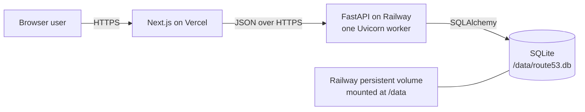
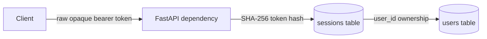
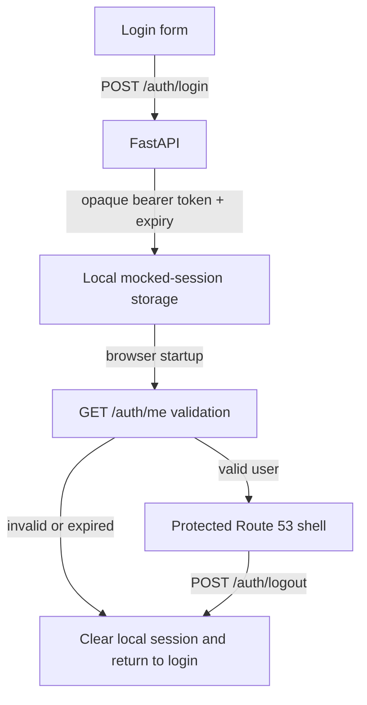
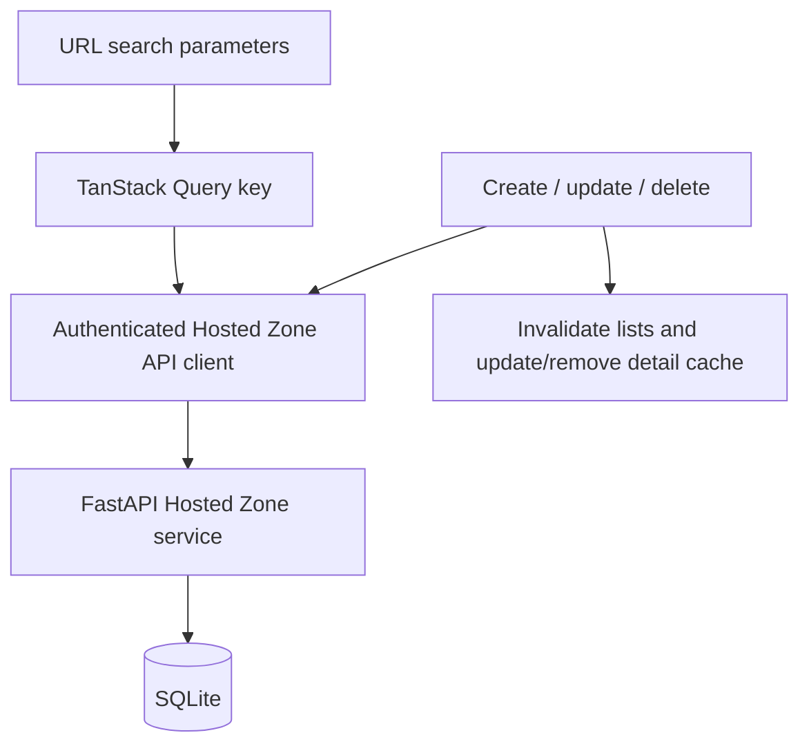
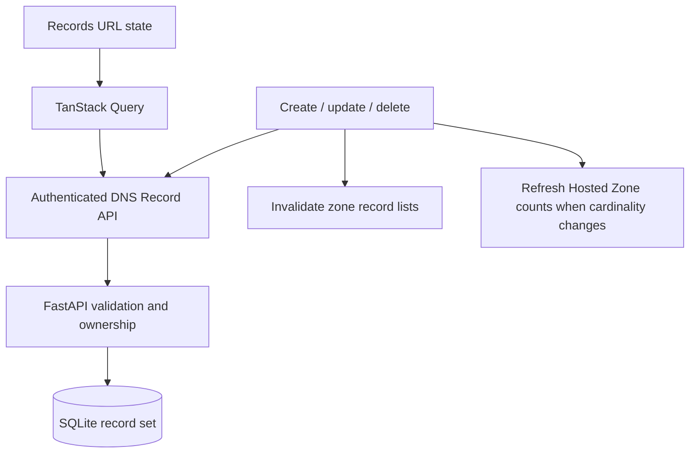
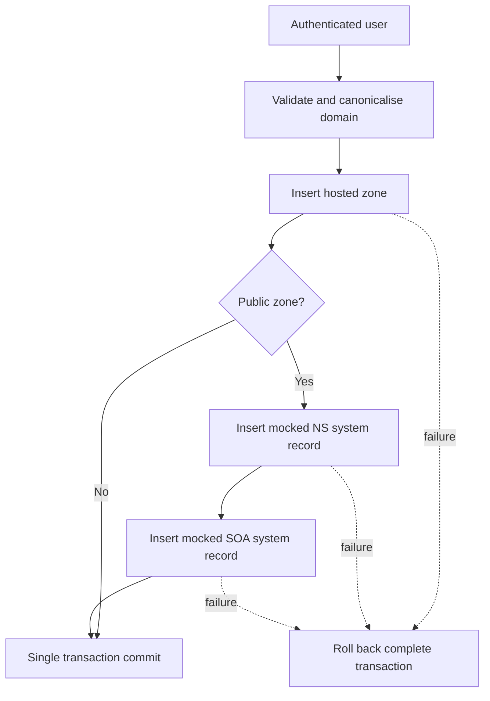
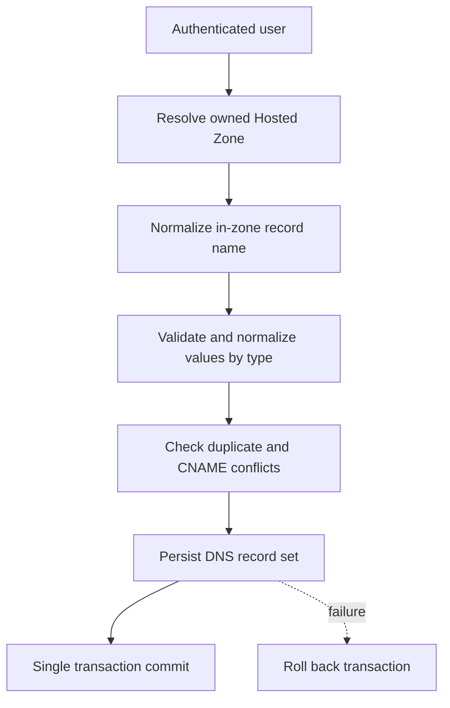

# Architecture

## System context

Route53 Clone is a learning-focused DNS management application. A browser client
uses an original Route53-inspired interface to manage mocked hosted zones and DNS
record sets. The system does not call AWS, publish DNS, or resolve real records.

The system is complete and production-verified at:

- Frontend: <https://route53-clone-three.vercel.app>
- Backend: <https://route53-clone-production-eb00.up.railway.app>
- Interactive API docs:
  <https://route53-clone-production-eb00.up.railway.app/docs>

The repository is a modular monolith with two deployable processes:

- A Next.js frontend renders the user experience and coordinates client state.
- A FastAPI backend owns application rules, persistence, and HTTP contracts.
- One SQLite database stores all application data.



## Responsibilities

### Frontend

The frontend owns rendering, accessibility, navigation, URL-derived list state,
form interaction, and displaying API outcomes. TanStack Query owns server-state
infrastructure. React Hook Form and Zod own form state and client-side validation.
URL search parameters own filtering, sorting, search, and pagination.
React Context is reserved for the mocked authentication session; modal visibility
and row selection remain local component state.

The frontend does not define authoritative business rules or directly access the
database.

### Backend

The backend validates requests, enforces authentication and ownership, applies
hosted-zone and record-set business rules, and produces stable JSON responses.
Each feature follows:

```text
API router -> Service -> Repository -> SQLAlchemy model/database
```

Routers translate HTTP input and output. Services coordinate business behaviour.
Repositories isolate queries and transactions. Models describe persistence.
Cross-feature infrastructure remains under `app/core`.

### Database

SQLite is the system of record. SQLAlchemy 2.x supplies the persistence boundary,
while Alembic owns schema changes. Foreign keys are enabled on every connection.
File-backed connections also use WAL journaling and a 30-second busy timeout to
reduce transient lock failures under the assignment's bounded concurrency. The
local URL is configurable; production uses `sqlite:////data/route53.db`.

## Modular-monolith decision

The assignment has one cohesive domain and a modest concurrency target. A modular
monolith makes boundaries testable without adding network calls or operational
components. It also keeps transactions involving zones, records, and sessions
atomic. Microservices, queues, Redis, and other distributed infrastructure would
increase failure modes without solving an assignment requirement.

## Request flow

1. Next.js sends a versioned JSON request to FastAPI.
2. The API router validates transport data with a Pydantic schema and resolves
   request dependencies.
3. A service enforces authentication, ownership, and domain rules.
4. A repository executes SQLAlchemy operations through the request-scoped session.
5. The service commits an intentional unit of work or rolls it back on failure.
6. The router serialises the response using a documented response schema.

No business policy belongs directly in route handlers or React components.

## Authentication

Authentication is deliberately mocked but persistent. It uses public demo
credentials and is not AWS IAM, Cognito, or another external identity system.



The login service normalises email, verifies the Argon2 password hash, generates
at least 256 bits of cryptographically secure token entropy, stores only the
token's SHA-256 hash, and returns the raw token once. Authenticated requests send
that raw value as `Authorization: Bearer <token>`. The dependency hashes it,
loads the session and owner in one repository operation, checks UTC expiry, and
returns the owning User. Logout deletes only the resolved current session.

Opaque sessions were selected over JWTs because they are easy to revoke, persist
naturally in the assignment database, add little complexity, and require no
refresh-token infrastructure. Database lookup overhead is acceptable for this
single-instance mocked application.

Repositories add, query, delete, and flush. Authentication services decide when
to commit or roll back; API routes never manage transactions. Failed login does
not mutate the database, successful login commits one session, and logout commits
one deletion.

### Frontend session flow

The browser implements authentication as a narrowly scoped React Context. It
uses the typed API client directly for authentication while TanStack Query
owns Hosted Zone and DNS Record server state.



Only the raw token and expiry are stored under `route53_clone_session`; neither
the password nor user profile is persisted. The provider first rejects locally
expired data, then restores user state only after `/auth/me` succeeds. Backend
authentication failures notify the provider so all authenticated clients
share the same clearing path. Logout clears the TanStack Query cache and local
state even if the backend is unreachable.

Local storage is acceptable here because this is an explicitly mocked,
time-boxed demonstration using public credentials. JavaScript can read local
storage, so a production-sensitive identity system would reassess the threat
model and normally use hardened, secure, HTTP-only cookie sessions plus CSRF and
content-security controls. This assignment deliberately does not represent that
choice as production authentication.

### Frontend Hosted Zone data flow

Hosted Zone server state is owned by TanStack Query. Table controls first
canonicalise URL search parameters; the complete list state forms the query key
and is passed to the authenticated API module without client-side filtering or
sorting.



Search, type, page, page size, sort field, and direction survive refresh and
browser navigation. Invalid values fall back locally before a request. Query
placeholder data retains the prior page during pagination and background
refreshes. Mutations never retry automatically; successful mutations update or
remove detail cache entries and invalidate every Hosted Zone list.

React Hook Form and Zod own basic create/edit form constraints while FastAPI
remains authoritative for DNS domain validation. Radix Dialog supplies focus
management for edit and typed-confirmation deletion, and Sonner supplies
screen-reader-announced transient success/copy notifications. Errors remain
inline as well as transient.

### Frontend DNS Record data flow

The nested records route resolves Hosted Zone context and uses an independent
URL-state parser for record search, readable type, SIMPLE routing, alias status,
pagination, and allowlisted sorting. The canonical parameter object is part of
the zone-scoped TanStack Query key; filtering and sorting never happen on a
partial client page.



List GETs can retry one transient failure and keep previous page data. Record
mutations never retry. Create and delete invalidate the zone detail and all
Hosted Zone lists so aggregate counts remain correct; update invalidates only
record data because cardinality is unchanged. System NS/SOA protection exists in
both the frontend controls and authoritative backend service.

React Hook Form and Zod parse one value per line, remove empty lines, stably
deduplicate exact trimmed input, and enforce bounded structural constraints.
FastAPI remains responsible for record-name canonicalisation, supported DNS
formats, CNAME conflicts, ownership, and database transactions.

## Hosted-zone lifecycle

Hosted-zone requests reuse the authenticated `User` resolved from the opaque
session. Every repository predicate includes that user ID, including detail,
update, and delete lookups. Missing and unowned identifiers therefore have one
indistinguishable not-found response.



Names are stored as lowercase absolute DNS names with one trailing dot. Public
zones receive deterministic, locally generated NS and SOA record sets; these are
persisted application data and do not delegate or publish real DNS. Private zones
have no generated records or VPC model in the current assignment contract.

Hosted-zone list queries apply ownership, search, type filters, an allowlisted
sort, stable ID tie-breaking, and offset pagination in SQLAlchemy. One aggregate
query returns the page with record counts and one query returns the total; the
service does not issue a record-count query per zone.

Repositories flush but do not commit. The hosted-zone service owns each
transaction: public-zone creation commits the zone plus NS and SOA together,
while comment updates and cascade deletes each commit once. Integrity conflicts
are rolled back and converted to the stable API contract.

## DNS record-set lifecycle

DNS record requests resolve ownership before looking up or mutating a record:



Record owner names and hostname targets deliberately use separate validators.
Owner names support relative resolution, apex aliases, controlled
leading-underscore service labels, and one leftmost wildcard while remaining
inside the Hosted Zone. Targets may be external, but permit neither underscores,
wildcards, IP addresses, nor URL syntax. Type validators canonicalize IPs,
hostnames, numeric fields, and spacing before stable value deduplication.

The service prevents apex and coexistence-invalid CNAMEs, rejects unsupported
aliases, and keeps `SOA` internal. Generated NS/SOA records use the same read
model but are protected from update and delete by `is_system`. Repositories
scope every record query to its already-owned zone and never commit.

Record listing uses one ownership query, one total query, and one paginated
record query, independent of result count. SQLite-compatible JSON-to-text casting
supports value search without related-resource loading or per-record queries.

## Deployment

Vercel hosts the Next.js frontend at
<https://route53-clone-three.vercel.app>. Railway runs the FastAPI container at
<https://route53-clone-production-eb00.up.railway.app> and mounts a persistent
volume at `/data`. The backend process uses exactly one Uvicorn worker because
multiple independent processes can contend for SQLite writes and do not share
in-process coordination. Railway supplies environment variables, including
`DATABASE_URL=sqlite:////data/route53.db` and the exact deployed frontend origin.

The backend image starts through `entrypoint.sh`. With fail-fast shell semantics,
it runs `alembic upgrade head`, runs the idempotent `python -m app.seed`, and only
then replaces the shell process with Uvicorn using Railway's `PORT` and exactly
one worker. A migration or seed failure therefore prevents an unhealthy API from
starting, while `exec` preserves termination-signal handling. The Railway health
check targets `/api/v1/health`. The image defaults to its non-root `app` user.
Railway volumes are root-mounted, so that service explicitly sets the
provider-supported `RAILWAY_RUN_UID=0`; the entrypoint verifies `/data` is
writable before migrating.

FastAPI accepts one normalized `FRONTEND_ORIGIN`; production requires HTTPS.
CORS permits bearer-token and JSON request headers plus only the HTTP methods
used by this API. It does not enable credentialed cookie requests. Vercel embeds
the public Railway API base URL at build time through `NEXT_PUBLIC_API_URL`. The
frontend rejects a missing, local, or insecure API URL when used from a deployed
production origin. The explicit localhost pair remains available for local
container testing.

The local Compose volume is mounted at `/app/data`; it intentionally does not
imitate or mount Railway's production `/data` volume.

Production acceptance verified authentication, Hosted Zone CRUD, DNS Record
CRUD, nested frontend-route refreshes, and exact-origin CORS. A Railway service
restart preserved the demo user, active session, Hosted Zones, DNS records, and
generated NS/SOA record sets; the idempotent seed completed without duplicating
or resetting the existing demo user.

## SQLite trade-offs

SQLite is appropriate because the assignment is a single-instance demonstration
with low write concurrency, simple operational requirements, and a mandated
persistent file. It offers transactions, constraints, and realistic persistence
without a managed database.

Its limitations are explicit: one writer at a time, no horizontal backend
scaling, file-level operational concerns, and no safe sharing across multiple
containers. The one-worker, one-instance deployment and persistent Railway volume
keep those constraints acceptable. A production DNS control plane at real scale
would require a client-server database and a different availability design.
