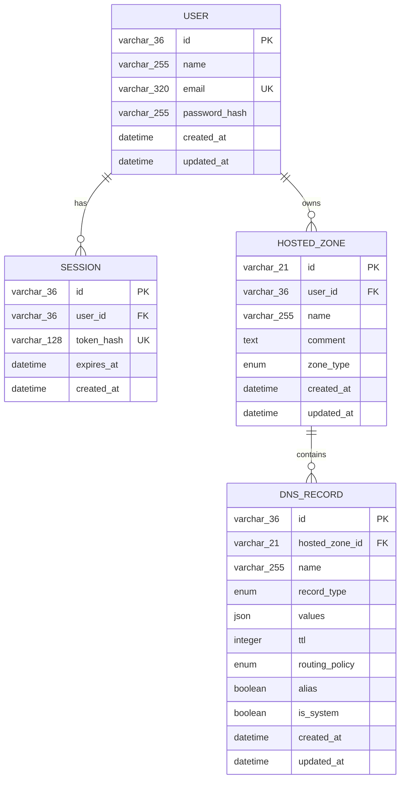

# Data model

The application implements a complete relational persistence schema for users,
mocked sessions, hosted zones, and DNS record sets. SQLAlchemy 2.x typed declarative
models are the schema source of truth; Alembic revision `67a8ad885a32` creates the
same structure on SQLite.



## Shared conventions

The metadata uses deterministic names for primary keys, foreign keys, unique
constraints, checks, and indexes so Alembic output remains stable.

User, Session, and DNSRecord IDs are UUID4 strings generated by a Python callable
when a row is flushed. HostedZone IDs are original Route53-inspired identifiers:
`Z` followed by 20 uppercase letters or digits, for a fixed maximum length of 21.
The large random space keeps collision probability low. These identifiers are
local application IDs and are never presented as real AWS identifiers.

Timestamp defaults are evaluated per row, not at module import. The model layer
normalises values to UTC and restores UTC timezone information when SQLite
returns a naive `DATETIME`. User, HostedZone, and DNSRecord update timestamps are
advanced by SQLAlchemy when those rows change.

## Enums

Enums are Python string enums backed by non-native SQLAlchemy enums. SQLite stores
their names as strings and enforces the permitted values with named check
constraints.

- `HostedZoneType`: `PUBLIC`, `PRIVATE`
- `DNSRecordType`: `A`, `AAAA`, `CNAME`, `TXT`, `MX`, `NS`, `PTR`, `SRV`, `CAA`,
  `SOA`
- `RoutingPolicy`: `SIMPLE`

`SOA` exists so public-zone creation can persist its generated apex SOA system
record. It is internal support and is not among the assignment's
user-created record types. Only simple routing is implemented; no additional
routing policies are implied by retaining that column.

## `users`

| Column | Storage | Null | Behaviour |
| --- | --- | --- | --- |
| `id` | `VARCHAR(36)` | No | UUID4 primary key |
| `name` | `VARCHAR(255)` | No | User display name |
| `email` | `VARCHAR(320)` | No | Globally unique login address |
| `password_hash` | `VARCHAR(255)` | No | Hash storage only; no plaintext |
| `created_at` | `DATETIME` | No | UTC creation time |
| `updated_at` | `DATETIME` | No | UTC creation/update time |

Constraints and indexes:

- Primary key `pk_users`
- Unique constraint `uq_users_email`
- Lookup index `ix_users_email`

User owns its sessions and hosted zones through bidirectional `back_populates`
relationships.

## `sessions`

| Column | Storage | Null | Behaviour |
| --- | --- | --- | --- |
| `id` | `VARCHAR(36)` | No | UUID4 primary key |
| `user_id` | `VARCHAR(36)` | No | FK to `users.id`, `ON DELETE CASCADE` |
| `token_hash` | `VARCHAR(128)` | No | Globally unique SHA-256 token hash |
| `expires_at` | `DATETIME` | No | UTC required expiry |
| `created_at` | `DATETIME` | No | UTC creation time |

Constraints and indexes:

- Primary key `pk_sessions`
- Foreign key `fk_sessions_user_id_users`
- Unique constraint `uq_sessions_token_hash`
- Indexes `ix_sessions_token_hash` and `ix_sessions_expires_at`

Only a SHA-256 hash of the cryptographically random token belongs in
`token_hash`; raw session tokens are never persisted. The authentication layer
implements creation, lookup, UTC expiration, detected-expiry cleanup, and
current-session deletion.

## `hosted_zones`

| Column | Storage | Null | Behaviour |
| --- | --- | --- | --- |
| `id` | `VARCHAR(21)` | No | Route53-inspired primary key |
| `user_id` | `VARCHAR(36)` | No | FK to `users.id`, `ON DELETE CASCADE` |
| `name` | `VARCHAR(255)` | No | Zone name |
| `comment` | `TEXT` | Yes | Optional operational description |
| `zone_type` | string enum | No | `PUBLIC` or `PRIVATE` |
| `created_at` | `DATETIME` | No | UTC creation time |
| `updated_at` | `DATETIME` | No | UTC creation/update time |

Constraints and indexes:

- Primary key `pk_hosted_zones`
- Foreign key `fk_hosted_zones_user_id_users`
- Enum check `ck_hosted_zones_hosted_zone_type`
- Unique constraint `uq_hosted_zones_user_id_name_zone_type` over
  `(user_id, name, zone_type)`
- Index `ix_hosted_zones_name`
- Composite index `ix_hosted_zones_user_id_name` over `(user_id, name)`

One user may therefore own one public and one private zone with the same name,
while duplicate zones of the same type are rejected. Domain normalisation is
intentionally not an ORM concern. The hosted-zone service persists canonical
lowercase absolute names such as `example.com.`.

## `dns_records`

| Column | Storage | Null | Behaviour |
| --- | --- | --- | --- |
| `id` | `VARCHAR(36)` | No | UUID4 primary key |
| `hosted_zone_id` | `VARCHAR(21)` | No | FK to `hosted_zones.id`, cascade delete |
| `name` | `VARCHAR(255)` | No | Record-set owner name |
| `record_type` | string enum | No | One supported DNS record type |
| `values` | `JSON` | No | Ordered array of record value strings |
| `ttl` | `INTEGER` | No | Range `1..2147483647` |
| `routing_policy` | string enum | No | Defaults to `SIMPLE` |
| `alias` | `BOOLEAN` | No | Defaults to false |
| `is_system` | `BOOLEAN` | No | Defaults to false |
| `created_at` | `DATETIME` | No | UTC creation time |
| `updated_at` | `DATETIME` | No | UTC creation/update time |

Constraints and indexes:

- Primary key `pk_dns_records`
- Foreign key `fk_dns_records_hosted_zone_id_hosted_zones` with
  `ON DELETE CASCADE`
- Enum checks `ck_dns_records_dns_record_type` and
  `ck_dns_records_routing_policy`
- TTL checks `ck_dns_records_ttl_minimum` and `ck_dns_records_ttl_maximum`
- Unique constraint `uq_dns_records_zone_id_name_record_type` over
  `(hosted_zone_id, name, record_type)`
- Index `ix_dns_records_name`
- Composite index `ix_dns_records_zone_id_name_record_type` over
  `(hosted_zone_id, name, record_type)`

A row represents one Route53-style record set, not one value. For example, both
MX targets for `example.com.` live in one JSON array and are written atomically.
SQLAlchemy's JSON type serialises the list for SQLite and restores it as
`list[str]`; mutable-list tracking also persists intentional in-place changes.
The hosted-zone service uses this representation for its generated public-zone
NS and SOA system record sets. The DNS record service validates user-created value syntax,
non-empty arrays, zone containment, CNAME coexistence, and type-specific rules
without putting business validation in the ORM.

## Relationships, loading, and cascades

```text
User
├── Sessions
└── HostedZones
    └── DNSRecords
```

All relationships are bidirectional and use `back_populates`. Collection and
parent loading uses SQLAlchemy's `selectin` strategy to avoid per-row N+1 queries
without embedding domain queries in models. ORM relationships use
`all, delete-orphan` on owned collections with passive database deletes.

Database foreign keys independently enforce ownership and use
`ON DELETE CASCADE`:

- Deleting a User removes that user's Sessions and HostedZones.
- Removing those HostedZones also removes their DNSRecords.
- Deleting a HostedZone removes its DNSRecords.
- Rows owned by other users are unaffected.
- Orphan inserts are rejected while SQLite foreign-key enforcement is active.

SQLite foreign keys are enabled on every application, test, and Alembic engine.

## Ownership and transaction boundaries

Ownership is rooted at `User -> HostedZone`; DNSRecord inherits ownership only
through its parent zone. Queries scope record access through the
authenticated user's zone and must never trust a client-supplied user ID.

The schema supplies integrity, not business workflows. The authentication service
owns session transaction boundaries. The hosted-zone service owns atomic zone
creation plus public NS/SOA records, comment updates, and cascade deletion.
The DNS record service owns user-managed record-set creation, value/TTL updates,
system-record protection, and deletion.
