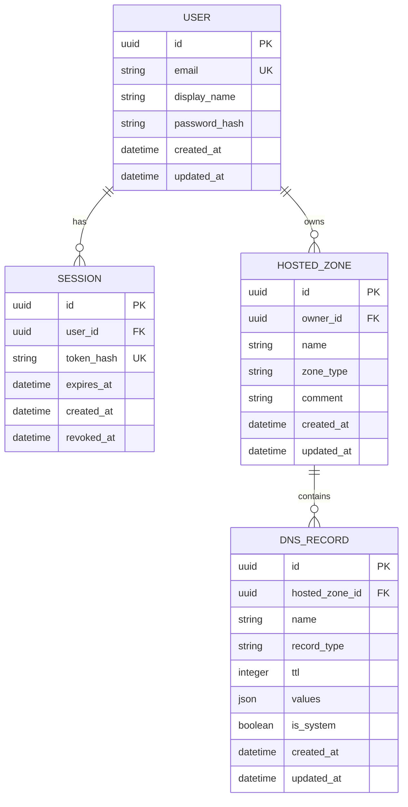

# Planned data model

Case 0 creates no entities or database migration. This document defines the
direction for Case 1 and later service rules. IDs will be UUID strings and
timestamps will be UTC.

## User

Represents a local mocked identity, not an AWS IAM principal.

- `email` is normalised to lowercase and globally unique.
- `password_hash` stores only a one-way hash, even though credentials are mocked.
- Owns sessions and hosted zones.
- Indexes: unique email; optional display-name index is unnecessary for P0.
- Deleting a user cascades to that user's sessions, zones, and records. The
  service must make this an explicit administrative action if ever exposed.

## Session

Represents one persistent mocked-login session.

- Belongs to exactly one user.
- Stores a cryptographic hash of an opaque token, never the raw cookie value.
- `token_hash` is globally unique and indexed for request authentication.
- `expires_at` is indexed to support expiry cleanup.
- `revoked_at` permits immediate logout and audit-friendly invalidation.
- Deleting a user cascades to sessions. Expired sessions may be deleted by later
  maintenance logic; no background worker is required.

The user relationship is the authentication boundary. A session never grants
access beyond its user's owned hosted zones.

## HostedZone

Represents an isolated DNS namespace owned by one user.

- `name` is an absolute, lowercase, IDNA-normalised DNS name ending in a dot.
- `zone_type` is constrained to `public` or `private`.
- `comment` is nullable and length-limited.
- `owner_id` is a required foreign key to `User`.
- Planned uniqueness: `(owner_id, name, zone_type)` prevents an accidental
  duplicate of the same zone kind for one user while allowing different users to
  own the same mocked namespace and allowing public/private counterparts.
- Indexes: `(owner_id, name)`, `(owner_id, zone_type)`, and creation time for
  owned list sorting.
- Deleting a hosted zone cascades to all of its DNS record sets at both ORM and
  database levels.

Public zones receive generated apex NS and SOA system records in the same
transaction as zone creation. Private zones do not receive those public
delegation records. A service, rather than a model event or route handler, owns
that policy.

## DNSRecord

Represents a DNS record set, not one value. `values` stores a JSON array so all
values for a name/type pair are edited atomically.

- Belongs to exactly one hosted zone.
- `name` is an absolute, normalised name constrained to the parent zone.
- `record_type` is one of `A`, `AAAA`, `CNAME`, `TXT`, `MX`, `NS`, `PTR`, `SRV`,
  or `CAA`.
- `ttl` is a positive bounded integer.
- `values` is a non-empty ordered JSON array validated by record type.
- `is_system` protects automatically generated NS and SOA rows. SOA is an
  internal system type even though user-created SOA records are not supported.
- Planned uniqueness: `(hosted_zone_id, name, record_type)`, ensuring multiple
  values are represented in one set.
- Indexes: `(hosted_zone_id, name)`, `(hosted_zone_id, record_type)`, and
  `(hosted_zone_id, is_system)`.
- Deleting a zone cascades to records. Records never cascade upward.

Service validation will enforce DNS rules that a simple constraint cannot:
CNAME coexistence, apex restrictions, value grammar, zone containment, duplicate
value normalisation, and protection of generated NS/SOA records.

## Ownership and transaction boundaries

Ownership is rooted at `User -> HostedZone`. Record queries must always scope by
both `hosted_zone_id` and the authenticated user's ownership of that zone. A
client-supplied user ID is never trusted.

Zone creation plus generated records, zone deletion plus record deletion, and
record-set writes each form one transaction. Repositories issue queries and
stage changes; services decide when a unit of work commits or rolls back.

SQLite foreign keys are enabled for every connection. Database constraints are
the final integrity layer, while services provide clear contract-level errors.
